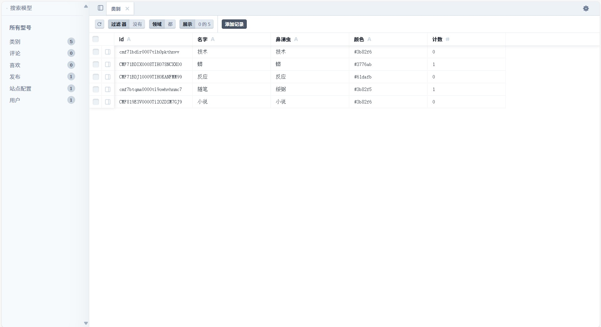
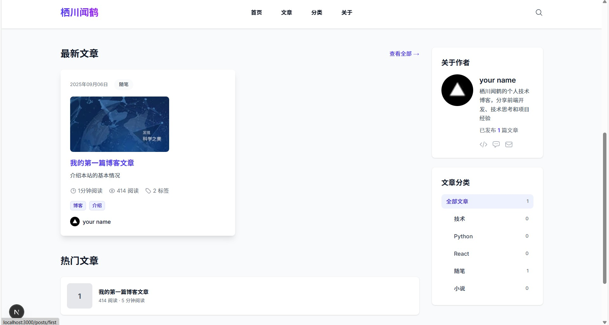

# 🚀 个人技术博客

一个基于 **Next.js 15.5.2** 和 **Prisma** 构建的现代化个人技术博客系统，采用 **App Router** 架构，支持 **TypeScript**、**Tailwind CSS 4.0**，并集成 **NextAuth.js** 认证系统。

## 📸 项目预览

<div align="center">\  <table>
    <tr>
      <td align="center">
        
        <br/>
        <em>数据库 - 简洁明了</em>
      </td>
      <td align="center">
        
        <br/>
        <em>博客首页 - 现代化设计</em>
      </td>
    </tr>
  </table>
</div>

## 🎯 核心功能

### ✅ 已实现功能
- **📱 响应式设计** - 完美适配桌面、平板、手机
- **📝 文章管理** - 完整的CRUD操作，支持Markdown
- **👤 作者系统** - 多作者支持，个人资料管理
- **🔍 全文搜索** - 基于Prisma的高效搜索
- **📊 访问统计** - 实时文章阅读量统计
- **🎨 主题切换** - 深色/浅色主题支持
- **🔐 认证系统** - 基于NextAuth.js的安全认证
- **⚡ 性能优化** - ISR静态生成，图片优化
- **🌐 SEO优化** - 完整的meta标签，结构化数据

### 🚧 计划中功能
- **💬 评论系统** - 基于GitHub Issues的评论
- **📧 订阅功能** - RSS和邮件订阅
- **🎯 标签系统** - 文章分类和标签
- **📱 PWA支持** - 离线访问和安装
- **🌍 国际化** - 中英文切换

## 🛠️ 技术栈详解

| 类别 | 技术 | 版本 | 用途 |
|---|---|---|---|
| **框架** | Next.js | 15.5.2 | React全栈框架 |
| **样式** | Tailwind CSS | 4.0 | 原子化CSS框架 |
| **数据库** | SQLite | 最新 | 轻量级数据库 |
| **ORM** | Prisma | 6.0 | 数据库ORM工具 |
| **认证** | NextAuth.js | 4.24 | 身份认证系统 |
| **语言** | TypeScript | 5.8 | 类型安全 |
| **部署** | Vercel | - | 云部署平台 |
| **图标** | Heroicons | 2.0 | SVG图标库 |
| **组件库** | Headless UI | 1.7 | 无样式组件 |

## 🚀 快速开始

### 📋 环境要求
- **Node.js**: 18.17.0 或更高版本
- **npm**: 9.0.0 或更高版本
- **Git**: 最新版本
- **操作系统**: Windows 10+ / macOS 10.15+ / Ubuntu 20.04+

### 🔧 安装步骤

#### 1. 克隆项目
```bash
# 使用HTTPS
git clone https://github.com/devon886/personal-blog.git

# 或使用SSH
git clone git@github.com:devon886/personal-blog.git

cd personal-blog
```

#### 2. 安装依赖
```bash
# 安装所有依赖
npm install

# 或使用pnpm（推荐）
pnpm install
```

#### 3. 环境变量配置

创建 `.env.local` 文件：

```bash
# 数据库配置
DATABASE_URL="file:./dev.db"

# NextAuth.js配置
NEXTAUTH_URL="http://localhost:3000"
NEXTAUTH_SECRET="your-secret-key-here"

# GitHub OAuth（可选）
GITHUB_ID="your-github-oauth-app-id"
GITHUB_SECRET="your-github-oauth-app-secret"

# 站点配置
SITE_NAME="个人技术博客"
SITE_DESCRIPTION="分享技术心得和开发经验"
```

#### 4. 数据库初始化
```bash
# 生成Prisma客户端
npx prisma generate

# 创建数据库表
npx prisma db push

# 填充初始数据
npx prisma db seed

# 验证数据
npx prisma studio
```

#### 5. 启动开发服务器
```bash
# 开发模式
npm run dev

# 或指定端口
npm run dev -- --port 3001
```

访问 **http://localhost:3000** 查看应用。

## 🗄️ 数据库管理

### 📊 Prisma Studio
可视化数据库管理工具：
```bash
npx prisma studio
```
访问 **http://localhost:5555** 管理数据。

### 🔄 数据库迁移
```bash
# 创建迁移
npx prisma migrate dev --name add-new-feature

# 重置数据库
npx prisma migrate reset

# 查看数据库状态
npx prisma db pull
```

### 🌱 数据填充
编辑 `prisma/seed.js` 添加测试数据：
```bash
npx prisma db seed
```

## 🚀 部署指南

### 🌐 Vercel部署（推荐）

#### 1. 准备代码
```bash
# 确保代码已推送到GitHub
git add .
git commit -m "Ready for deployment"
git push origin main
```

#### 2. Vercel配置
- 访问 [vercel.com](https://vercel.com)
- 导入GitHub项目
- 配置环境变量：
  - `DATABASE_URL`
  - `NEXTAUTH_URL`
  - `NEXTAUTH_SECRET`

#### 3. 一键部署
点击部署按钮，Vercel会自动构建并部署。

### 🐳 Docker部署
```bash
# 构建镜像
docker build -t personal-blog .

# 运行容器
docker run -p 3000:3000 personal-blog
```

### 🏠 其他平台
- **Netlify**: 支持Next.js的静态导出
- **Railway**: 一键部署，支持数据库
- **Render**: 免费静态站点托管

## 📁 项目结构详解

```
personal-blog/
├── 📁 src/                    # 源代码目录
│   ├── 📁 app/               # Next.js App Router
│   │   ├── 📁 api/          # API路由
│   │   ├── 📁 about/        # 关于页面
│   ├── 📁 components/        # React组件
│   │   ├── 📁 ui/          # 基础UI组件
│   │   ├── 📁 layout/      # 布局组件
│   │   └── 📁 forms/       # 表单组件
│   ├── 📁 lib/             # 工具库
│   │   ├── 📁 db/          # 数据库相关
│   │   ├── 📁 auth/        # 认证相关
│   │   └── 📁 utils/       # 工具函数
│   └── 📁 types/           # TypeScript类型定义
├── 📁 prisma/              # 数据库配置
│   ├── 📄 schema.prisma   # 数据库模式
│   ├── 📄 seed.js         # 数据种子
│   └── 📄 dev.db          # SQLite数据库
├── 📁 public/             # 静态资源
│   ├── 📁 images/         # 图片资源
│   └── 📁 icons/          # 图标资源
├── 📁 scripts/            # 构建和更新脚本
│   ├── 📄 create-default-images.mjs
│   ├── 📄 update-author-avatars.js
│   └── 📄 sync-views.js
├── 📄 package.json        # 项目配置
├── 📄 tsconfig.json       # TypeScript配置
├── 📄 tailwind.config.ts  # Tailwind配置
└── 📄 README.md           # 项目文档
```

## 🎨 自定义配置

### 👤 修改作者信息

#### 方法1：使用Prisma Studio
```bash
npx prisma studio
```
在浏览器中修改 `User` 和 `SiteConfig` 表。

#### 方法2：直接编辑种子文件
编辑 `prisma/seed.js`：
```javascript
const siteConfig = {
  name: "你的名字",
  description: "你的博客描述",
  logo: "/images/logo.png",
  // ...其他配置
}
```

### 🎯 添加新文章

#### 方法1：使用API
```bash
curl -X POST http://localhost:3000/api/posts \
  -H "Content-Type: application/json" \
  -d '{
    "title": "新文章标题",
    "content": "文章内容...",
    "authorId": 1
  }'
```

#### 方法2：使用Prisma Studio
在Prisma Studio中直接添加 `Post` 记录。

### 🎨 主题定制

#### 修改品牌色
编辑 `tailwind.config.ts`：
```typescript
colors: {
  primary: {
    50: '#eff6ff',
    500: '#3b82f6',
    900: '#1e3a8a',
  }
}
```

#### 添加新字体
```bash
npm install @next/font
```

## 🔍 开发调试

### 🐛 常见问题解决

#### 数据库连接问题
```bash
# 检查数据库文件
ls -la prisma/

# 重置数据库
npx prisma migrate reset

# 重新生成客户端
npx prisma generate
```

#### 构建失败
```bash
# 清理缓存
npm run clean

# 重新构建
npm run build

# 检查TypeScript错误
npx tsc --noEmit
```

#### 端口占用
```bash
# 检查端口
netstat -ano | findstr :3000

# 使用其他端口
npm run dev -- --port 3001
```

### 📊 性能监控

#### Lighthouse评分
```bash
npm run build
npm run start
# 访问 http://localhost:3000 进行测试
```

#### 包大小分析
```bash
npm install --save-dev @next/bundle-analyzer
npm run analyze
```

## 🤝 贡献指南

### 🎯 开发流程
1. Fork 项目
2. 创建功能分支：`git checkout -b feature/AmazingFeature`
3. 提交更改：`git commit -m 'Add some AmazingFeature'`
4. 推送到分支：`git push origin feature/AmazingFeature`
5. 开启 Pull Request

### 📋 代码规范
- 使用 **ESLint** 进行代码检查
- 使用 **Prettier** 进行代码格式化
- 使用 **Conventional Commits** 提交规范

### 🧪 测试
```bash
# 运行测试
npm test

# 运行测试并监听
npm run test:watch

# 生成测试覆盖率报告
npm run test:coverage
```

## 📄 许可证

本项目采用 **MIT许可证** - 详见 [LICENSE](LICENSE) 文件。

## 🙋‍♂️ 支持与联系

- **Issues**: [GitHub Issues](https://github.com/[your-username]/personal-blog/issues)
- **Discussions**: [GitHub Discussions](https://github.com/[your-username]/personal-blog/discussions)
- **Email**: [your-email@example.com](mailto:your-email@example.com)

## 🎉 致谢

- [Next.js](https://nextjs.org/) - 优秀的React框架
- [Prisma](https://www.prisma.io/) - 强大的ORM工具
- [Tailwind CSS](https://tailwindcss.com/) - 实用的CSS框架
- [Vercel](https://vercel.com/) - 出色的部署平台

---

<div align="center">
  <p>⭐ 如果这个项目对你有帮助，请给个Star！</p>
  <p>
    <a href="https://github.com/devon886/personal-blog">🚀 GitHub仓库</a>
    <span>·</span>
    <a href="https://devon886-personal-blog.vercel.app">🌐 在线演示</a>
  </p>
</div>
